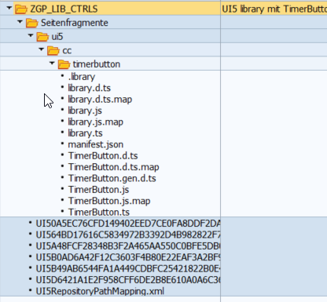

# UI5 Library ui5.cc.timerbutton

This library provides enhanced sap.m.Button controls.
The following buttons are implemented
- TimerButton, a button that delays enable or visible event and shows other text and/or icon while the button is disabled

## Description

### TimerButton

The TimerButton control is a regular sap.m.Button with the following additional feature

 This control works as folows.
 - You set the enabled or visible property of your Button to false
 - The control gets disabled or invisible, see property timeoutEventType
 - if timeoutEventType === enabled
     - The control shows the "timeoutIcon" (property) instead of the original icon
     - after you set the enabled property of the button to true shows the "timeoutButtonText" (property), if defined
 - after "timeout" (property) milliseconds the button gets enabled / visible and the original text and icon are shown at the button.

Here are the additional properties that can be used

```
/**
  * time in milliseconds that the control stays in disabled/invisible state after the enabled/visible property
  * has been set to true
  */
timeout: {
  type: 'int',
  group: 'Misc',
  defaultValue: 5000
},
/**
  * text that is displayed at the button in the time the enabled property has been set to true until timeout
  * is reached and the button is enabled again. After that time the original text of the button is displayed.
  */
timeoutButtonText: {
  type: 'string',
  group: 'Misc',
  defaultValue: null
},
/**
  * Icon that is displayed at the button in the time the enabled property has been set to true until timeout
  * is reached and the button is enabled again. After that time the original icon of the button is displayed.
  */
timeoutIcon: {
  type: 'string',
  group: 'Misc',
  defaultValue: 'sap-icon://pending'
},
/**
  * Event that the functionality is working with. Currently enabled and visible events are supported.
  */
timeoutEventType: {
  type: "ui5.cc.timerbutton.EventType",
  group: "Misc",
  defaultValue: TimeoutEventType.enabled
}
```

## Requirements

Either [npm](https://www.npmjs.com/) or [yarn](https://yarnpkg.com/) for dependency management.

## Preparation

Use `npm` (or `yarn`) to install the dependencies:

```sh
npm install
```

(To use yarn, just do `yarn` instead.)

## Run the Library

Execute the following command to run the library locally for development in watch mode (the browser reloads the app automatically when there are changes in the source code):

```sh
npm start
```

As shown in the terminal after executing this command, the app is then running on http://localhost:8080/. A browser window with the URL pointing to your controls' test page should automatically open.

(When using yarn, do `yarn start` instead.)

## Debug the Library

In the browser, you can directly debug the original TypeScript code, which is supplied via sourcemaps (need to be enabled in the browser's developer console if it does not work straight away). If the browser doesn't automatically jump to the TypeScript code when setting breakpoints, use e.g. `Ctrl`/`Cmd` + `P` in Chrome to open the `*.ts` file you want to debug.

## Build the Library

### Unoptimized (but quick)

Execute the following command to build the project and get an app that can be deployed:

```sh
npm run build
```

The result is placed into the `dist` folder. To start the generated package, just run

```sh
npm run start:dist
```

Note that HTML page still loads the UI5 framework from the relative URL `resources/...`, which does not physically exist, but is only provided dynamically by the UI5 tooling. So for an actual deployment you should change this URL to either [the CDN](https://sdk.openui5.org/#/topic/2d3eb2f322ea4a82983c1c62a33ec4ae) or your local deployment of UI5.

(When using yarn, do `yarn build` and `yarn start:dist` instead.)

## Check the Code

Do the following to run a TypeScript check:

```sh
npm run ts-typecheck
```

This checks the libraries code for any type errors (but will also complain in case of fundamental syntax issues which break the parsing).

To lint the TypeScript code, do:

```sh
npm run lint
```

(Again, when using yarn, do `yarn ts-typecheck` and `yarn lint` instead.)

## Deploy to ABAP server 

To deploy and use the library to an ABAP server (e.g. SAP Netweaver 7.50) you can do the following (there are other ways to achieve this).

Install the `nwabap:upload` npm package   
`npm install nwabap:upload`

In the root folder of your project create a file `.nwabaprc`.  
The file should have the following content (adjust to your needs):
```
{
    "base": "./dist/resources",
    "conn_server": "https://abapserver.my.lan:50001",
    "conn_usestrictssl": "false",
    "conn_user": "<Your ABAP user name>",
    "conn_password": "<Your ABAP user password>",
    "conn_client": "001",
    "abap_language": "DE",
    "abap_package": "Z_APPS",
    "abap_bsp": "ZGP_LIB_CTRLS",
    "abap_bsp_text": "UI5 library mit TimerButton",
    "abap_transport": "XXXK9999999",
    "files_start_with_dot" : "true",
    "calcappindex": true
}
```
It's important that this configuration contains the undocumented `files_start_with_dot: true` line cause otherwise the `.library` file 
will not be deployed.  

After you created this file just run `npm run deploy`.  
You will see something like this in transaction `se80`.



### Use your library in UI5 app 

To use the controls in your UI5 apps just add it to your `manifest.json`

```
  "sap.ui5": {
    ...
    ...
    "dependencies": {
      "minUI5Version": "1.108.19",
      "libs": {
        "sap.ui.core": {},
        "sap.ui.layout": {},
        "sap.m": {},
        "ui5.cc.timerbutton": {}
      }
    },
```

Now you can use the control in your views 

```
<mvc:View
	controllerName="my.namespace.controller.Main"
	displayBlock="true"
	xmlns="sap.m"
	xmlns:core="sap.ui.core"
	xmlns:l="sap.ui.layout"
  xmlns:timerbtn="ui5.cc.timerbutton">

  ...
  ...
  ...

        <timerbtn:TimerButton
          id='btnSaveChanges'
          text="{i18n>save}"
          timeout="15000"
          timeoutButtonText="{i18n>timeoutbutton.timeouttext}"
          type="Success"
          press=".onSaveChanges"
        />
```

### Use the library at dev time on localhost 

Most developers develop their UI5 application on their local PC and access the app locally at `http://localhost...`.  
This is achieved by using `ui5 serve` from the UI5 tooling.  
Cause you cannot access the ABAP runtime from there you need to tell your local server (aka ui5 serve) where to find the 
library.  

Install the `ui5.cc.timerbutton` as dev dependency.  
`npm install -D ui5-cc-timerbutton`

Then add the following to your `ui5.yaml`.  
It's important that the `ui5-middleware-servestatic` follows the proxy middleware (fiori-tools-proxy in my case) cause otherwise 
the timerbutton mountPath will not be available.

```
server:
    customMiddleware:
        - name: ui5-middleware-livereload
          afterMiddleware: compression
          configuration:
              debug: true
              extraExts: 'xml,json,properties'
              port: 35729
              path: 'webapp'
        - name: fiori-tools-proxy
          afterMiddleware: compression
          configuration:
              ignoreCertError: true # If set to true, certificate errors will be ignored. E.g. self-signed certificates will be accepted
              ui5:
                  path:
                      - /resources
                      - /test-resources
                  url: https://ui5.sap.com
        - name: ui5-middleware-servestatic
          afterMiddleware: compression
          mountPath: /resources/ui5/cc/timerbutton/
          configuration:
            rootPath: ./node_modules/ui5-cc-timerbutton/dist/resources/ui5/cc/timerbutton/
```

## License

This project is licensed under the MIT License, except as noted otherwise in the [LICENSE](LICENSE) file.

---

###### This template is provided to you by Wouter Lemaire and contributors :wink:
